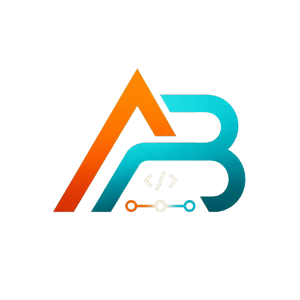

<div align="center">



# Achraf Boutzad — Portfolio

**Software Engineer · DevOps Engineer**

Personal portfolio showcasing real-time operational software — dashboards, monitoring systems, APIs, and IoT integrations.

[**achrafboutzad.com**](https://achrafboutzad.com) · [LinkedIn](https://www.linkedin.com/in/achraf-boutzad/) · [Email](mailto:achrafboutzad@gmail.com)

</div>

---

## About

This is the source code of my personal portfolio, a fully static, animated single-page site built with the latest Next.js and deployed to GitHub Pages under a custom domain.

It highlights my work at **Haldorix — MARWA Corporation**, where I build production monitoring platforms, IoT telemetry systems, and workflow orchestration tools using Spring Boot, FastAPI, Next.js, Kafka, MQTT, and WebSockets.

## Features

- **Modern dark design** — custom ink-black palette with tangerine and teal accents
- **Rich scroll animations** — powered by [Motion](https://motion.dev): aurora background, animated hero name reveal, orbiting skill keywords, scroll-velocity marquee, pinned horizontal project gallery, count-up stats, and parallax effects
- **Fully responsive** — tuned layouts from mobile to widescreen
- **SEO ready** — Open Graph metadata, JSON-LD structured data, and semantic markup
- **CV download** — one-click download of my latest resume
- **Static export** — zero-server deployment, fast loads, hosted free on GitHub Pages

## Tech Stack

| Layer      | Technology                                  |
| ---------- | ------------------------------------------- |
| Framework  | [Next.js 16](https://nextjs.org) (App Router, static export) |
| UI         | [React 19](https://react.dev) + [Tailwind CSS v4](https://tailwindcss.com) |
| Animations | [Motion](https://motion.dev)                |
| Language   | TypeScript                                  |
| Deployment | GitHub Actions → GitHub Pages               |

## Project Structure

```
src/
├── app/                  # App Router: layout, page, global styles, icons
├── components/
│   ├── animations/       # Reusable motion primitives (Aurora, Orbit, Parallax, ...)
│   ├── sections/         # Page sections (Hero, About, Skills, Projects, ...)
│   ├── Navbar.tsx
│   ├── Logo.tsx
│   └── CvDownload.tsx
└── lib/
    ├── content.ts        # All portfolio content in one place
    └── seo.ts            # Metadata, Open Graph, JSON-LD
```

All text, projects, experience, and links live in `src/lib/content.ts` — editing content never requires touching components.

## Getting Started

```bash
# Install dependencies
npm install

# Start the dev server
npm run dev
```

Open [http://localhost:3000](http://localhost:3000) in your browser.

### Other scripts

```bash
npm run build             # Production build (static export to /out)
npm run lint              # Lint the codebase
npm run generate-favicon  # Regenerate favicon from the logo
```

## Deployment

Every push to `main` triggers a GitHub Actions workflow (`.github/workflows/deploy.yml`) that builds the static export and publishes it to GitHub Pages at [achrafboutzad.com](https://achrafboutzad.com).

## Contact

- **Email:** [achrafboutzad@gmail.com](mailto:achrafboutzad@gmail.com)
- **LinkedIn:** [linkedin.com/in/achraf-boutzad](https://www.linkedin.com/in/achraf-boutzad/)
- **Location:** Casablanca, Morocco

---

<div align="center">

Designed & built by **Achraf Boutzad** · © 2026

</div>
